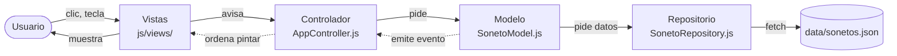
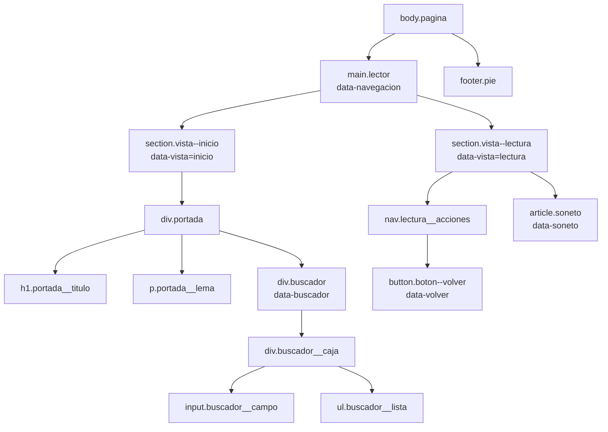
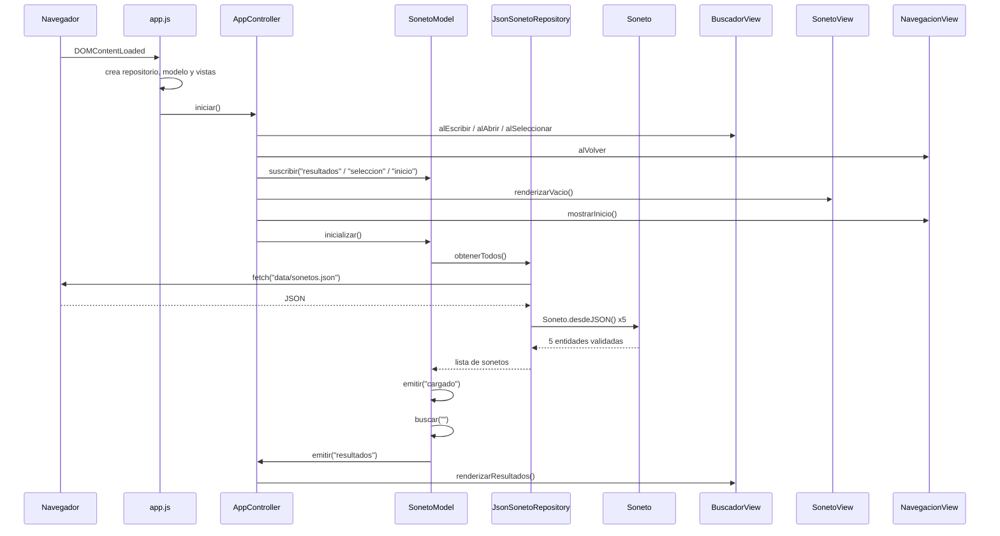
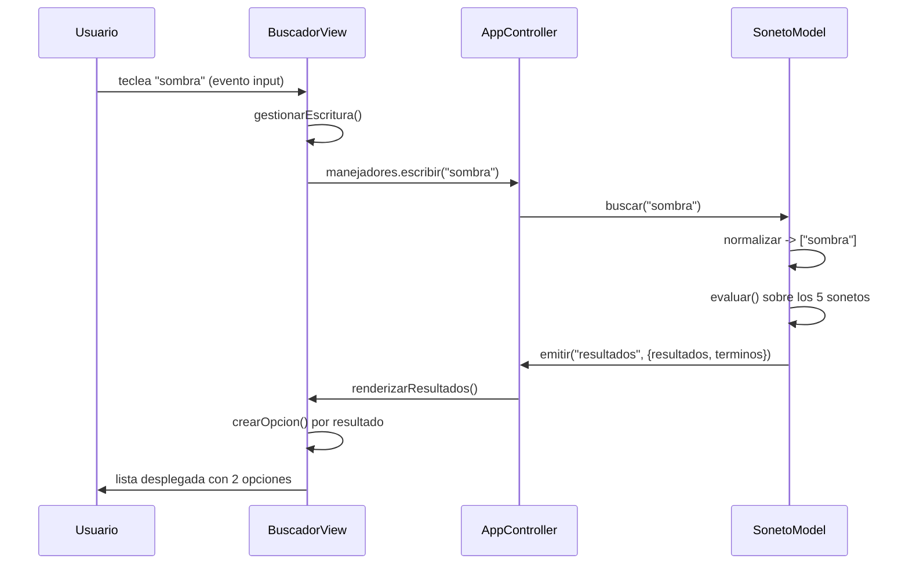
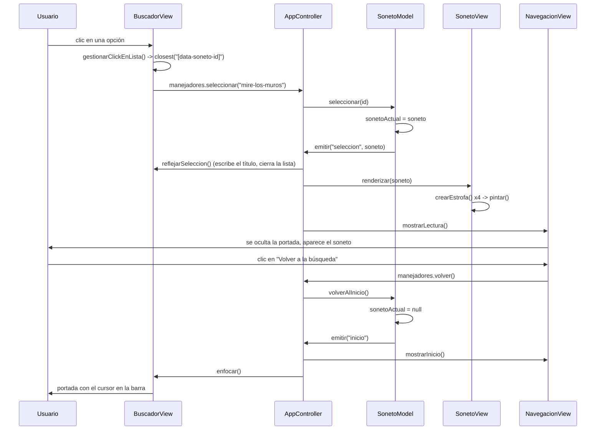

# GUÍA DEL PROYECTO — Lector de sonetos

Documento de estudio. Explica **qué hace cada fichero, cada elemento y cada función** del proyecto, a nivel
básico y suponiendo poca experiencia previa. El objetivo es poder defender la práctica ante el profesor y
responder a cualquier pregunta sobre cualquier línea.

Los otros documentos del repositorio cubren otras necesidades:

| Documento | Para qué sirve |
|---|---|
| [`README.md`](README.md) | Visión de arquitectura y decisiones de diseño, a nivel técnico medio |
| [`INSTALL.md`](INSTALL.md) | Descargar el proyecto y levantarlo |
| [`CLAUDE.md`](CLAUDE.md) | Normas obligatorias de desarrollo |
| **`GUIA.md`** (este) | **Entender el código para explicarlo** |

---

## Índice

0. [Cómo usar esta guía](#0-cómo-usar-esta-guía)
1. [Visión general](#1-visión-general)
2. [`index.html`](#2-indexhtml)
3. [Los CSS](#3-los-css)
4. [`data/sonetos.json`](#4-datasonetosjson)
5. [El modelo](#5-el-modelo)
6. [Las vistas](#6-las-vistas)
7. [El controlador y el arranque](#7-el-controlador-y-el-arranque)
8. [Trazas paso a paso](#8-trazas-paso-a-paso)
9. [Glosario de JavaScript](#9-glosario-de-javascript)
10. [Preguntas del profesor](#10-preguntas-del-profesor)

---

## 0. Cómo usar esta guía

**Orden de lectura recomendado**: 1 → 9 (glosario, por encima) → 2 → 3 → 4 → 5 → 6 → 7 → 8 → 10.

Si vas justo de tiempo, con la **sección 1** (visión general), la **8** (trazas) y la **10** (preguntas) se
puede sostener una defensa: la 1 explica el porqué, la 8 demuestra que entiendes el recorrido del código y la
10 te prepara para lo que probablemente te pregunten.

Cada función se explica con la misma plantilla:

> **`nombre(parámetros)`**
> **Recibe** · **Devuelve** · **Qué hace** · **Por qué existe**

Los fragmentos de código de esta guía están **copiados literalmente del proyecto**, con su ruta encima. Si al
leerlos no coinciden con el fichero, manda el fichero.

---

## 1. Visión general

### 1.1 Qué hace la aplicación

Es una página web que permite **leer sonetos**. El usuario ve una portada con una barra de búsqueda; escribe
(o simplemente pulsa la barra) y aparece una lista de sonetos; elige uno y la pantalla cambia al soneto
completo, con un botón para volver.

Un **soneto** es un poema de **14 versos** en cuatro estrofas: dos **cuartetos** (4 versos cada uno) y dos
**tercetos** (3 versos cada uno). Esa estructura se respeta en los datos, en el HTML y en el diseño.

Está hecha con **HTML, CSS y JavaScript puro**: sin React, sin jQuery, sin npm, sin compilar nada. Se abre con
un servidor web y funciona.

### 1.2 Qué es MVC, sin jerga

**MVC** significa *Modelo – Vista – Controlador*. Es una forma de repartir el trabajo para que cada parte del
código tenga **una sola responsabilidad**. El símil del restaurante:

| Pieza | En el restaurante | En nuestro código |
|---|---|---|
| **Modelo** | La cocina: tiene la comida y sabe prepararla. No sale a la sala. | Guarda los sonetos y sabe buscarlos. **No toca la pantalla.** |
| **Vista** | La sala: mesas, carta, lo que el cliente ve y toca. No cocina. | Pinta el HTML y escucha clics y teclas. **No decide nada.** |
| **Controlador** | El camarero: lleva el pedido a la cocina y el plato a la mesa. | Recibe lo que hace el usuario, se lo pide al modelo y manda pintar el resultado. |

**La regla de oro del proyecto**: si aparece la palabra `document` (la pantalla) fuera de `js/views/`, está
mal colocado. Y el modelo no importa ninguna vista.

**¿Por qué molestarse?** Porque así se puede cambiar el aspecto sin tocar la lógica, probar la lógica sin
navegador (lo hacemos: el modelo se ejecuta en Node) y porque cada fichero se entiende solo.

### 1.3 Qué es el patrón Repository

El **repositorio** es la pieza que sabe **de dónde salen los datos**. Aquí salen de un fichero
`data/sonetos.json`, pero mañana podrían salir de una base de datos o de una API.

En lugar de que el modelo haga el `fetch` directamente, existe una clase intermedia. El modelo dice «dame
todos los sonetos» y no le importa de dónde vienen. Si cambiamos el origen, se escribe **una clase nueva** y
el modelo no se toca ni una línea.

### 1.4 El flujo completo



Las flechas continuas son llamadas directas; las punteadas son **avisos** (eventos). Fíjate en que **no hay
ninguna flecha entre el modelo y las vistas**: nunca se hablan.

### 1.5 Mapa de ficheros

```
ipo2627_panama_sonetos/
├── index.html                  La única página. Define el esqueleto de las dos pantallas.
├── data/
│   └── sonetos.json            Los 5 sonetos. Datos puros, sin código.
├── css/
│   ├── reset.css               Pone el navegador a cero (quita márgenes por defecto).
│   ├── variables.css           Todos los colores, tipografías y medidas, en un solo sitio.
│   ├── layout.css              Dónde va cada caja (Grid y Flexbox).
│   └── components.css          Cómo se ve cada pieza (portada, buscador, soneto…).
├── js/
│   ├── app.js                  Arranca todo: crea los objetos y los conecta.
│   ├── models/
│   │   ├── Soneto.js           Qué es un soneto y cómo se valida.
│   │   ├── SonetoRepository.js De dónde salen los sonetos.
│   │   └── SonetoModel.js      El estado y la búsqueda.
│   ├── views/
│   │   ├── NavegacionView.js   Cambia entre la pantalla de inicio y la de lectura.
│   │   ├── BuscadorView.js     La barra de búsqueda y su desplegable.
│   │   └── SonetoView.js       Pinta el soneto en pantalla.
│   └── controllers/
│       └── AppController.js    Conecta las vistas con el modelo.
└── sonetos/                    Los poemas originales en texto. Documentación, no se usan al ejecutar.
```

**Ocho ficheros JavaScript, cuatro de CSS, un HTML y un JSON.** Nada más.

---

## 2. `index.html`

Es la **única** página del proyecto. Define el esqueleto; el contenido variable lo pone el JavaScript.

### 2.1 La cabecera (`<head>`)

```html
<link rel="stylesheet" href="css/reset.css">
<link rel="stylesheet" href="css/variables.css">
<link rel="stylesheet" href="css/layout.css">
<link rel="stylesheet" href="css/components.css">

<script type="module" src="js/app.js"></script>
```

**El orden de los CSS importa.** El navegador aplica las hojas en el orden en que las lee, y si dos reglas
chocan gana la última. Por eso van: primero el *reset* (pone todo a cero), luego las variables (define los
valores), luego el *layout* (coloca las cajas) y por último los componentes (los detalles visuales).

**`<script type="module">`** significa que el fichero es un **módulo de JavaScript**: puede usar `import` para
traer otros ficheros. Además, los módulos **se ejecutan solos al final**, cuando la página ya está construida
— por eso puede ir en el `<head>` y no hace falta ponerlo al final del `<body>` como se hacía antes.

Solo se enlaza **un** fichero JS. Los otros siete los trae `app.js` con sus `import`.

### 2.2 Las dos pantallas

```html
<main class="lector" data-navegacion>
  <section class="vista vista--inicio" data-vista="inicio"> … </section>
  <section class="vista vista--lectura vista--oculta" data-vista="lectura" hidden> … </section>
</main>
```

Las dos secciones **existen siempre** en el documento. Lo que cambia es cuál está visible: la que no toca
lleva la clase `vista--oculta` (que le aplica `display: none`) y el atributo `hidden`.

**¿Por qué no crear y destruir el HTML cada vez?** Porque así el navegador no tiene que reconstruir nada, el
cambio es instantáneo y el marcado se lee entero en el fichero, que es más fácil de defender.

### 2.3 Los atributos `data-*`

```html
<input class="buscador__campo" id="buscador-campo" … data-buscador-campo>
```

Un atributo que empieza por `data-` es un atributo **inventado por nosotros** que HTML permite. Sirve para
marcar un elemento sin afectar a su aspecto.

El JavaScript busca los elementos por ahí: `document.querySelector("[data-buscador]")`. **¿Por qué no por
clase?** Porque las clases son del diseño: si mañana renombramos `.buscador` por motivos de estilo, el
JavaScript dejaría de encontrar el elemento. Los `data-*` son el «contrato» entre el HTML y el JS, y nadie los
toca por motivos visuales.

Anclajes usados: `data-navegacion`, `data-vista`, `data-volver`, `data-buscador`, `data-buscador-campo`,
`data-buscador-lista`, `data-soneto` y, puesto por el JS, `data-soneto-id`.

### 2.4 El buscador accesible

```html
<input class="buscador__campo" id="buscador-campo" type="search" role="combobox"
       placeholder="Busca por título, autor o verso…" autocomplete="off" spellcheck="false"
       aria-expanded="false" aria-controls="buscador-lista" aria-autocomplete="list"
       data-buscador-campo>

<ul class="buscador__lista" id="buscador-lista" role="listbox" aria-label="Sonetos disponibles"
    hidden data-buscador-lista></ul>
```

Los atributos que empiezan por `aria-` y `role` no cambian nada visualmente: son para los **lectores de
pantalla** (programas que leen la web en voz alta a personas ciegas).

| Atributo | Qué le dice al lector de pantalla |
|---|---|
| `role="combobox"` | «Esto no es un campo de texto normal: es un campo con lista desplegable.» |
| `aria-expanded` | «La lista está desplegada (`true`) o replegada (`false`).» El JS lo actualiza. |
| `aria-controls` | «El campo controla el elemento con `id="buscador-lista"`.» |
| `aria-autocomplete="list"` | «Al escribir aparecerán sugerencias en una lista.» |
| `role="listbox"` / `role="option"` | «Esto es una lista de opciones elegibles.» |
| `aria-activedescendant` | «La opción marcada ahora mismo es esta.» Lo pone el JS al navegar con flechas. |
| `aria-live="polite"` (en el soneto) | «Cuando esto cambie, léelo, pero sin interrumpir.» |

`autocomplete="off"` evita que el navegador ofrezca sus propias sugerencias encima de las nuestras.

### 2.5 El árbol del documento



Lo que cuelga de `ul.buscador__lista` y de `article.soneto` lo crea el JavaScript en tiempo de ejecución: en
el HTML están vacíos.

### 2.6 Etiquetas semánticas

Usamos `<main>`, `<section>`, `<nav>`, `<article>`, `<header>`, `<footer>` en lugar de `<div>` para todo.
Un `<div>` no significa nada; `<article>` dice «esto es una pieza de contenido con sentido propio» —el
soneto—, y `<nav>` dice «esto es navegación». El navegador y los lectores de pantalla lo aprovechan, y el
profesor lo va a mirar: el enunciado pide «cuidar el etiquetado HTML para reflejar la estructura del soneto».

---

## 3. Los CSS

Cuatro hojas, cada una con un trabajo distinto. Se explican por bloques; el detalle de cada propiedad se lee
en el propio fichero, que está comentado.

### 3.1 `reset.css` — poner el navegador a cero

Cada navegador trae sus propios márgenes y tamaños por defecto (los títulos separados, las listas con puntos,
etc.). Si no los quitas, tu diseño se ve distinto en cada uno. Un **reset** los iguala:

```css
* {
    margin: 0;
    padding: 0;
    box-sizing: border-box;
}
```

- El `*` significa «todos los elementos».
- `margin` es el espacio **por fuera** de una caja; `padding`, el espacio **por dentro**.
- **`box-sizing: border-box`** es la línea más importante del fichero. Por defecto, si pones a una caja
  `width: 200px` y `padding: 20px`, la caja mide 240 px: el navegador suma el relleno por fuera. Con
  `border-box`, la caja mide 200 px y el relleno va por dentro. Las cuentas salen y nada se desborda.

El fichero también quita las viñetas de las listas, hace que `input` y `button` hereden la tipografía (por
defecto no lo hacen) y define un foco visible:

```css
:focus-visible {
    outline: 0.15em solid var(--color-acento);
    outline-offset: 0.15em;
}
```

`:focus-visible` es el elemento que tiene el foco **cuando el usuario navega con teclado**. Es un requisito de
accesibilidad: quien no usa ratón tiene que ver dónde está.

### 3.2 `variables.css` — el sistema de diseño

Aquí viven **todos** los colores, tipografías y medidas del proyecto. Ningún otro fichero inventa un valor.

Una **custom property** (o variable CSS) es un valor con nombre. Se declara con dos guiones y se usa con
`var()`:

```css
:root { --tono: 35; }
.algo { color: hsl(var(--tono), 30%, 14%); }
```

`:root` es el elemento raíz del documento (el `<html>`). Lo que se declara ahí lo ve **toda** la página.

#### Cómo leer `hsl()`

`hsl()` define un color con tres números: **tono, saturación y luminosidad**.

| Parámetro | Qué es | Rango |
|---|---|---|
| Tono (*hue*) | El color en la rueda cromática: 0 rojo, 120 verde, 240 azul | 0–360 |
| Saturación | Cuánto color tiene: 0 % gris, 100 % puro | 0–100 % |
| Luminosidad | Cuánta luz: 0 % negro, 100 % blanco | 0–100 % |

Nuestro `--tono: 35` es un naranja apagado: el sepia del papel antiguo.

**La estrategia es monocromática**: *un solo tono* para toda la aplicación, y las diferencias se consiguen
moviendo la saturación y la luminosidad. Por eso todos los colores se derivan del mismo `--tono`:

```css
--color-lienzo: hsl(var(--tono), var(--saturacion-suave), 96%);   /* casi blanco: el papel */
--color-tinta:  hsl(var(--tono), var(--saturacion-tinta), 14%);   /* casi negro: la letra */
--color-acento: hsl(var(--tono), var(--saturacion-viva), 32%);    /* el más saturado: destaca */
```

Y las saturaciones se calculan unas de otras con **`calc()`**, que hace operaciones aritméticas en CSS:

```css
--saturacion: 30%;
--saturacion-viva: calc(var(--saturacion) + 25%);   /* = 55% */
```

**Consecuencia para la defensa**: si cambias `--tono: 35` por `--tono: 210`, toda la aplicación se vuelve azul
de forma coherente, sin tocar ninguna otra línea. Eso es lo que el profesor quiere ver.

#### Las dos tipografías

```css
--fuente-lectura: "Iowan Old Style", "Palatino Linotype", Palatino, Georgia, serif;
--fuente-interfaz: "Segoe UI", system-ui, -apple-system, sans-serif;
```

Dos familias **contrastadas**: una **serif** (con remates en los extremos de las letras, la de los libros)
para el poema, y una **sans-serif** (sin remates, más neutra) para botones y menús. Se listan varias fuentes
porque no todos los sistemas tienen las mismas: el navegador usa la primera que encuentre.

#### Las medidas fluidas

```css
--escala-verso: clamp(1rem, 0.85rem + 0.6vw, 1.3rem);
```

**`clamp(mínimo, ideal, máximo)`** da un valor que crece con la pantalla pero nunca se sale de los límites.
Aquí: nunca menor de `1rem`, nunca mayor de `1.3rem`, y entre medias crece según el ancho de la ventana.

Unidades que verás:

| Unidad | Qué significa |
|---|---|
| `rem` | Relativa al tamaño de letra base del navegador (normalmente 16 px). `1.5rem` = 24 px |
| `em` | Relativa al tamaño de letra **del propio elemento** |
| `%` | Porcentaje del contenedor |
| `vw` / `vh` | 1 % del ancho / alto de la ventana |
| `px` | Píxeles fijos. **Casi prohibido**: solo para bordes de 1 px |

**¿Por qué evitar `px`?** Porque si un usuario agranda la letra del navegador porque ve poco, los `px` no le
hacen caso y los `rem` sí. Es accesibilidad.

#### Las medidas clave del diseño

```css
--medida-verso: 34em;               /* ≈ 60 caracteres por línea */
--espacio-verso: 0.15em;
--espacio-estrofa: 1.9em;           /* Gestalt (proximidad) */
```

`--medida-verso` limita el ancho del texto: una línea de más de 60-70 caracteres cansa la vista porque cuesta
encontrar dónde empieza la siguiente. Los otros dos se explican en el recuadro de Gestalt, más abajo.

### 3.3 `layout.css` — dónde va cada caja

#### Grid y Flexbox en cristiano

Son las dos formas modernas de colocar elementos:

- **Flexbox** (`display: flex`) coloca los hijos **en una línea**, en fila o en columna. Úsalo cuando lo que
  quieres es apilar cosas.
- **Grid** (`display: grid`) coloca los hijos en una **rejilla** de filas y columnas. Úsalo cuando defines una
  estructura de página.

Los dos tienen `gap`, que es el hueco entre hijos, y evita tener que ir poniendo márgenes a mano.

**La norma del proyecto**: todo contenedor usa Grid o Flexbox. El «flujo normal» (los elementos cayendo uno
debajo de otro por defecto) solo se deja para las **hojas de texto**: los `<p>` de los versos.

#### La página

```css
.pagina {
    min-block-size: 100vh;
    display: grid;
    grid-template-rows: 1fr auto;
}
```

Dos filas: el contenido (`1fr`, «todo el espacio sobrante») y el pie (`auto`, «lo que ocupe»). `100vh` asegura
que la página ocupe al menos la altura de la ventana, para que el pie no suba.

`min-block-size` es la versión «lógica» de `min-height`: funciona igual, pero se adapta si el idioma escribe
en vertical. Verás también `inline-size` (ancho), `inset-block-start` (arriba) y `margin-block-end` (margen
inferior).

#### La portada

```css
.vista--inicio {
    justify-items: center;
    align-content: start;
    padding-block-start: clamp(2rem, 12vh, 8rem);
}
```

Centrada en horizontal, pero **anclada arriba**, no centrada en vertical. Es deliberado: el desplegable del
buscador se abre hacia abajo y necesita ese hueco libre. Si la portada estuviera centrada, la lista se saldría
de la pantalla y aparecería scroll.

#### La alternancia de vistas

```css
.vista--oculta,
.vista[hidden] {
    display: none;
}
```

Esta es la única regla que hace que solo se vea una pantalla. El JavaScript pone y quita la clase.

### 3.4 `components.css` — cómo se ve cada pieza

#### Qué es BEM

**BEM** = *Block, Element, Modifier*. Es una forma de nombrar las clases para que no choquen:

| Parte | Sintaxis | Ejemplo | Significado |
|---|---|---|---|
| Bloque | `.bloque` | `.buscador` | Una pieza independiente |
| Elemento | `.bloque__elemento` | `.buscador__campo` | Una parte que solo existe dentro del bloque |
| Modificador | `.bloque--modificador` | `.vista--oculta` | Una variante o un estado |

Ventaja: leyendo `.buscador__opcion--activa` ya sabes dónde está y qué es, sin abrir el HTML. Y como cada
nombre es único, **ningún estilo se cuela** donde no debe.

#### Qué es el anidamiento nativo

CSS permite ahora escribir los elementos de un bloque **dentro** de la llave del bloque:

```css
.buscador {
    .buscador__campo { … }
    .buscador__opcion { … }
}
```

Es lo mismo que escribirlos por separado, pero el fichero queda agrupado por piezas y se ve de un vistazo qué
pertenece a qué.

#### Los bloques del proyecto

| Bloque | Qué es | Elementos y modificadores destacados |
|---|---|---|
| `.portada` | El conjunto título + lema de la pantalla de inicio | `__titulo` (serif, enorme), `__lema` (versalitas discretas) |
| `.buscador` | La barra de búsqueda y su desplegable | `__campo`, `__campo--abierto`, `__lista`, `__opcion`, `__opcion--activa` (la marcada con flechas), `__opcion--seleccionada` (la que se está leyendo), `__opcion-titulo`, `__opcion-autor`, `__opcion-verso`, `__vacio` |
| `.soneto` | La hoja de lectura | `__encabezado`, `__titulo`, `__autor`, `__anio`, `__estrofa`, `__estrofa--cuarteto`, `__estrofa--terceto`, `__verso`, `__mensaje`; y los estados `--vacio` y `--entrando` |
| `.boton` | El botón de volver | `__icono` |
| `.pie` | El pie de página | `__texto` |
| `.visualmente-oculta` | Utilidad: oculta a la vista pero **no** a los lectores de pantalla | — |

`.visualmente-oculta` merece una nota: se usa en la etiqueta del buscador. Visualmente sobra (el `placeholder`
ya lo explica), pero un lector de pantalla necesita la etiqueta. Se usa `clip-path` en vez de
`display: none` porque `display: none` sí que la ocultaría también al lector.

#### Los estados son clases, nunca estilos en línea

Está **prohibido** en el proyecto escribir estilos desde JavaScript con `elemento.style`. En su lugar, el CSS
define el estado y el JS solo añade o quita la clase:

```css
.buscador__opcion--activa { background-color: var(--color-acento); }
```

```js
opcion.classList.toggle("buscador__opcion--activa", esActiva);
```

**¿Por qué?** Porque así todo el aspecto vive en el CSS y todo el comportamiento en el JS. Si mezclas, acabas
buscando colores dentro del JavaScript.

### 3.5 Recuadro: la especificidad (y un fallo real que tuvimos)

Cuando dos reglas afectan al mismo elemento, gana la **más específica**. Se cuenta así:

| Tipo de selector | Peso |
|---|---|
| `#id` | 100 |
| `.clase`, `[atributo]`, `:pseudoclase` | 10 |
| `elemento` | 1 |

Ejemplo real del proyecto: la lista del buscador **se veía al cargar la página**, aunque tenía el atributo
`hidden`. ¿Por qué? Porque el navegador aplica `display: none` a `[hidden]` (peso 10), pero nosotros teníamos:

```css
.buscador { .buscador__lista { display: flex; } }   /* .buscador .buscador__lista = peso 20 */
```

20 gana a 10, así que la lista se mostraba. La solución fue devolverle el `display: none` con el mismo peso:

```css
.buscador__lista[hidden] { display: none; }   /* 10 + 10 = 20, y va después */
```

Por eso el proyecto **prohíbe los `#id` en CSS**: pesan 100 y ganan casi siempre, lo que obliga a subir la
apuesta y acabas usando `!important`, que rompe la cascada entera.

### 3.6 Recuadro: las leyes de la Gestalt

La Gestalt son principios de percepción: cómo agrupa el ojo las cosas **antes** de que el cerebro lea. En el
proyecto hay tres aplicadas, y conviene saber señalarlas:

**Proximidad** — lo que está cerca se percibe como un grupo. Es lo que hace que se vean cuatro estrofas sin
leer una palabra:

```css
.soneto__verso { margin-block-end: var(--espacio-verso); }        /* 0.15em entre versos */
.soneto__estrofa + .soneto__estrofa { margin-block-start: var(--espacio-estrofa); }   /* 1.9em entre estrofas */
```

La separación entre estrofas es **más de diez veces** la que hay entre versos. Esa diferencia es la ley.

(El selector `A + B` significa «un B que viene justo después de un A»: así la primera estrofa no lleva margen
arriba, solo las siguientes.)

**Figura y fondo** — el soneto es una hoja clara, con borde y sombra, que «flota» sobre el fondo; el buscador
es un panel de servicio. El ojo separa inmediatamente lo que es contenido de lo que es herramienta.

**Semejanza** — lo que se parece se percibe como de la misma clase. Aquí: **todo lo que es poema va en serif y
todo lo que es interfaz va en sans-serif**, sin excepciones. Por eso, en la lista de resultados, el verso va
en serif cursiva y el autor en sans-serif: se distinguen sin leerlos.

---

## 4. `data/sonetos.json`

### 4.1 Qué es JSON

**JSON** (*JavaScript Object Notation*) es un formato de texto para guardar datos. Solo tiene llaves para
objetos, corchetes para listas, textos entre comillas dobles, números, `true`/`false` y `null`. **No admite
comentarios ni comas sobrantes al final**: un despiste ahí rompe el fichero entero.

### 4.2 El esquema

```json
{
  "sonetos": [
    {
      "id": "a-una-nariz",
      "titulo": "A una nariz",
      "autor": "Francisco de Quevedo",
      "estrofas": [
        { "tipo": "cuarteto", "orden": 1, "versos": ["…", "…", "…", "…"] },
        { "tipo": "cuarteto", "orden": 2, "versos": ["…", "…", "…", "…"] },
        { "tipo": "terceto",  "orden": 3, "versos": ["…", "…", "…"] },
        { "tipo": "terceto",  "orden": 4, "versos": ["…", "…", "…"] }
      ]
    }
  ]
}
```

| Campo | Tipo | Para qué sirve |
|---|---|---|
| `id` | texto | Identificador único, en minúsculas y con guiones. Es la «matrícula» del soneto: por él se selecciona y por él viaja al HTML como `data-soneto-id` |
| `titulo` | texto | Se muestra en la lista y en el encabezado del poema |
| `autor` | texto | Igual |
| `anio` | número | **Opcional.** Si está, se pinta bajo el autor; si falta, no se pinta nada |
| `estrofas` | lista | Las cuatro estrofas, en orden |
| `estrofas[].tipo` | `"cuarteto"` o `"terceto"` | El JS lo convierte en la clase CSS `soneto__estrofa--cuarteto` |
| `estrofas[].orden` | número | Posición de la estrofa. El modelo ordena por él al cargar, por si vienen desordenadas |
| `estrofas[].versos` | lista de textos | 4 versos si es cuarteto, 3 si es terceto |

### 4.3 Por qué los versos van agrupados por estrofa

Podríamos haber guardado los 14 versos en una sola lista plana. No lo hacemos porque entonces el JavaScript
tendría que **contar** («del 1 al 4 es el primer cuarteto, del 5 al 8 el segundo…») para saber dónde termina
cada estrofa. Al venir agrupados, el HTML generado refleja la métrica sin que nadie tenga que contar, y el CSS
puede separar estrofas con una sola regla.

### 4.4 Para añadir un soneto

Se edita **solo** este fichero. Ninguna línea de código cambia. Si la métrica no cuadra (una estrofa con
versos de más o de menos), la aplicación avisa con un error en la consola en lugar de pintar algo roto —de eso
se encarga `Soneto.desdeJSON`, que se explica ahora mismo—.

---

## 5. El modelo

Tres ficheros en `js/models/`. Ninguno puede tocar la pantalla; de hecho podemos ejecutarlos con Node, sin
navegador, y es así como comprobamos que la búsqueda funciona.

Cada función se explica con la misma plantilla: **recibe**, **devuelve**, **qué hace**, **por qué existe**.

### 5.1 `Soneto.js` — qué es un soneto

#### Las constantes

```js
const VERSOS_POR_TIPO = {
  cuarteto: 4,
  terceto: 3
};

const VERSOS_DE_UN_SONETO = 14;
```

Son las reglas de la métrica escritas como datos. Están en constantes y no «sueltas» dentro del código para
que quien lea el fichero vea la regla de un vistazo, y para no repetir el número 4 en varios sitios.

#### `normalizar(texto)`

```js
export function normalizar(texto) {
  return texto
    .normalize("NFD")
    .replace(/\p{Diacritic}/gu, "")
    .toLowerCase();
}
```

- **Recibe**: un texto cualquiera.
- **Devuelve**: el mismo texto en minúsculas y sin tildes ni diéresis.
- **Qué hace**, en tres pasos:
  1. `normalize("NFD")` **descompone** cada letra acentuada en dos piezas: la letra y la tilde. La «ó» pasa a
     ser «o» + «´».
  2. `.replace(/\p{Diacritic}/gu, "")` borra todas esas tildes sueltas. Lo que va entre barras es una
     **expresión regular** (un patrón de búsqueda); `\p{Diacritic}` significa «cualquier marca diacrítica»,
     la `g` significa «todas, no solo la primera» y la `u` activa el modo Unicode.
  3. `.toLowerCase()` pasa a minúsculas.
- **Por qué existe**: para que buscar «gongora» encuentre a «Góngora» y «QUEVEDO» encuentre a «Quevedo». Sin
  esto, el usuario tendría que escribir las tildes exactas.

Es una función **pura**: con la misma entrada da siempre la misma salida y no toca nada externo. Por eso está
permitido que las vistas la importen sin romper la separación de capas.

#### `class Soneto` — el constructor

```js
constructor({ id, titulo, autor, anio = null, estrofas }) {
  this.id = id;
  …
  this.tituloNormalizado = normalizar(titulo);
  this.autorNormalizado = normalizar(autor);
  this.versosNormalizados = this.versos.map(normalizar);
}
```

- **Recibe**: un objeto con los datos del soneto. Las llaves de los parámetros son **desestructuración**:
  en vez de recibir un objeto y escribir `datos.titulo`, se sacan los campos directamente por su nombre.
  `anio = null` es un **valor por defecto**: si no viene, vale `null`.
- **Qué hace**: guarda los datos y, además, **precalcula** las versiones normalizadas del título, el autor y
  los catorce versos.
- **Por qué existe ese precálculo**: el texto de un soneto no cambia nunca, pero el usuario teclea muchas
  veces. Si normalizáramos en cada pulsación, repetiríamos el mismo trabajo una y otra vez. Se hace una vez al
  cargar y se guarda.

#### `get versos`

```js
get versos() {
  return this.estrofas.flatMap((estrofa) => estrofa.versos);
}
```

- **Devuelve**: los 14 versos en una sola lista, en orden de lectura.
- **Qué hace**: `flatMap` recorre las cuatro estrofas, coge la lista de versos de cada una y las **aplana** en
  una única lista. Sin `flatMap` tendríamos una lista de cuatro listas.
- **`get`** significa que es un *getter*: se usa como si fuera un dato (`soneto.versos`, **sin paréntesis**)
  aunque por dentro ejecute código.
- **Por qué existe**: para buscar y para contar es cómodo tener los versos planos; para pintar es cómodo
  tenerlos agrupados. Guardamos lo segundo y calculamos lo primero.

#### `get primerVerso`

Devuelve `this.versos[0]`. Es una comodidad; hoy no se usa en la interfaz.

#### `static desdeJSON(datos)`

- **Recibe**: un objeto tal cual viene del fichero JSON.
- **Devuelve**: un objeto `Soneto` ya validado.
- **Lanza un error** si los datos no son correctos.
- **Qué hace**, en orden:
  1. Comprueba que existen `id`, `titulo`, `autor` y que `estrofas` es una lista.
  2. Comprueba que hay exactamente **cuatro** estrofas.
  3. Para cada estrofa, mira en `VERSOS_POR_TIPO` cuántos versos debería tener y comprueba que los tiene. Si
     el tipo no es «cuarteto» ni «terceto», también falla.
  4. Comprueba que el total son **14** versos.
  5. Ordena las estrofas por su campo `orden` y construye el `Soneto`.
- **`static`** significa que el método pertenece a la clase, no a cada objeto: se llama
  `Soneto.desdeJSON(...)`, no `unSoneto.desdeJSON(...)`.
- **Por qué existe**: es un **guardián**. Si alguien añade un soneto con trece versos, la aplicación falla al
  cargar con un mensaje claro («El soneto "X" tiene 13 versos en lugar de 14») en lugar de pintar un poema
  roto. Los errores se detectan en el sitio donde está la causa, no tres capas más allá.

> **Pregunta típica**: «¿Dónde validáis que un soneto es un soneto?» → Aquí, en `Soneto.desdeJSON`, y la regla
> métrica está en las constantes de arriba del fichero.

### 5.2 `SonetoRepository.js` — de dónde salen los datos

#### `class SonetoRepository` — el contrato

```js
async obtenerTodos() {
  throw new Error("SonetoRepository.obtenerTodos() debe implementarse en una subclase.");
}
```

- **Qué es**: una clase **abstracta**. No sirve para usarla directamente: define **qué** métodos debe tener
  cualquier fuente de datos, sin decir **cómo**.
- **Por qué lanza un error**: JavaScript no tiene clases abstractas de verdad, así que se simula. Si alguien
  hereda de ella y se olvida de escribir `obtenerTodos`, el error salta de inmediato y explica qué falta.

#### `obtenerPorId(id)`

- **Recibe**: el identificador de un soneto.
- **Devuelve**: una **promesa** con el soneto, o con `null` si no existe.
- **Qué hace**: pide todos los sonetos y busca el que coincide con `find`. El `?? null` significa «si lo
  anterior es `undefined` o `null`, usa `null`»: así el resultado es siempre `null` y no `undefined`.
- **Por qué está en la clase base**: porque se puede escribir **una sola vez** usando `obtenerTodos`, sea cual
  sea la fuente de datos. Cualquier subclase lo hereda gratis.

#### `class JsonSonetoRepository extends SonetoRepository`

`extends` significa «hereda de»: esta clase tiene todo lo de `SonetoRepository` y además lo suyo.

**Constructor**

```js
constructor(url) {
  super();
  this.url = url;
  this.cache = null;
}
```

`super()` llama al constructor de la clase padre; es obligatorio antes de usar `this` en una clase que hereda.
`this.cache` empieza vacía: es donde se guardarán los sonetos una vez descargados.

**`obtenerTodos()`**

- **Devuelve**: una promesa con la lista de objetos `Soneto`.
- **Qué hace**, en orden:
  1. Si ya hay algo en `this.cache`, lo devuelve sin más. **Esto es la caché**: el fichero no cambia mientras
     la página está abierta, así que descargarlo dos veces sería tirar el tiempo.
  2. `await fetch(this.url)` pide el fichero al servidor. `fetch` es la función del navegador para pedir
     cosas por red, y `await` significa «espera a que llegue antes de seguir».
  3. Si `respuesta.ok` es falso (un 404, por ejemplo), lanza un error con el código.
  4. `await respuesta.json()` convierte el texto descargado en un objeto de JavaScript.
  5. Comprueba que el objeto trae una lista en `sonetos`.
  6. Convierte cada elemento con `Soneto.desdeJSON` —aquí es donde se valida la métrica— y guarda el resultado
     en la caché.
- **Por qué existe esta clase aparte**: porque es **lo único** que sabe que los datos vienen de un JSON por
  HTTP. Para cambiar a una base de datos, se escribe otra clase con el mismo `obtenerTodos` y se cambia una
  línea en `app.js`. Ni el modelo ni las vistas se enteran.

> **Pregunta típica**: «¿Por qué no hacéis el `fetch` directamente en el modelo?» → Porque entonces el modelo
> dependería de HTTP y no se podría probar sin servidor. Con el repositorio, en las pruebas le pasamos una
> clase falsa que devuelve sonetos de mentira.

### 5.3 `SonetoModel.js` — el estado y la búsqueda

#### Las constantes

```js
const PESO_TITULO = 3;
const PESO_AUTOR = 2;
const PESO_VERSO = 1;

export const MAXIMO_RESULTADOS = 3;
```

Los pesos son la **relevancia**: si tu palabra aparece en el título, el soneto puntúa 3; en el autor, 2; en un
verso, 1. `MAXIMO_RESULTADOS` es cuántas opciones se muestran como mucho en el desplegable.

#### El constructor

```js
constructor(repositorio, maximoResultados = MAXIMO_RESULTADOS) {
  this.repositorio = repositorio;
  this.maximoResultados = maximoResultados;

  this.sonetos = [];
  this.consulta = "";
  this.resultados = [];
  this.sonetoActual = null;

  this.suscriptores = new Map();
}
```

- **Recibe**: el repositorio (quien le traerá los datos) y, opcionalmente, cuántos resultados mostrar.
- **Qué guarda**: los sonetos cargados, lo último que se buscó, los resultados de esa búsqueda, cuál se está
  leyendo, y la lista de «suscriptores» (ahora la vemos).
- **Fíjate**: el repositorio **se recibe desde fuera**, no se crea aquí dentro. Eso se llama *inyección de
  dependencias* y es lo que permite pasarle un repositorio falso en las pruebas.

#### El patrón observador: `suscribir` y `emitir`

Esta es la parte que más se pregunta, así que va despacio.

**El problema**: cuando el modelo termina una búsqueda, hay que repintar la lista. Pero el modelo **no puede**
llamar a la vista: tiene prohibido conocerla.

**La solución**: el modelo no llama a nadie; **anuncia** lo que le ha pasado. Quien quiera enterarse, se
apunta antes.

```js
suscribir(evento, callback) {
  if (!this.suscriptores.has(evento)) {
    this.suscriptores.set(evento, []);
  }
  this.suscriptores.get(evento).push(callback);
}

emitir(evento, datos) {
  const callbacks = this.suscriptores.get(evento) ?? [];
  for (const callback of callbacks) {
    callback(datos);
  }
}
```

- **`suscribir(evento, callback)`** — recibe el nombre de un aviso y una **función** que se ejecutará cuando
  ocurra. La guarda en un `Map` (una lista de pares nombre → valor). Si es el primero de ese aviso, crea la
  lista.
- **`emitir(evento, datos)`** — recorre las funciones apuntadas a ese aviso y las llama, pasándoles los datos.

Los cuatro avisos del proyecto:

| Aviso | Cuándo se emite | Qué datos lleva |
|---|---|---|
| `cargado` | Cuando los sonetos terminan de descargarse | La lista de sonetos |
| `resultados` | Cada vez que se busca | Los resultados y los términos |
| `seleccion` | Cuando se elige un soneto | El soneto elegido |
| `inicio` | Cuando se pulsa «Volver» | Nada |

El único que se apunta a escuchar es el **controlador**, que traduce cada aviso en órdenes para las vistas.

**Por qué merece la pena**: el modelo funciona igual si mañana la interfaz es otra, o si no hay interfaz
ninguna. Es lo que nos permite ejecutarlo en Node para probar la búsqueda.

#### `inicializar()`

```js
async inicializar() {
  this.sonetos = await this.repositorio.obtenerTodos();
  this.emitir("cargado", this.sonetos);
  this.buscar("");
}
```

- **Qué hace**: pide los sonetos al repositorio, espera a que lleguen, avisa de que ya están, y lanza una
  búsqueda vacía para que el desplegable tenga contenido desde el principio.
- **`async` / `await`**: descargar un fichero tarda. `async` marca la función como «de las que esperan» y
  `await` pausa ahí hasta que el dato llega, sin congelar la página.
- **Por qué la búsqueda vacía**: con la consulta vacía, la puntuación de todos es 0 y entran todos (recortados
  a `MAXIMO_RESULTADOS`). Así, al pulsar la barra, el usuario ve sonetos sin haber escrito nada.

#### `buscar(consulta)`

```js
buscar(consulta) {
  this.consulta = consulta;

  const terminos = normalizar(consulta).split(/\s+/).filter((termino) => termino.length > 0);

  const encontrados = this.sonetos
    .map((soneto) => this.evaluar(soneto, terminos))
    .filter((resultado) => resultado !== null)
    .sort((uno, otro) => otro.puntuacion - uno.puntuacion || uno.soneto.titulo.localeCompare(otro.soneto.titulo));

  this.resultados = encontrados.slice(0, this.maximoResultados);

  this.emitir("resultados", { resultados: this.resultados, terminos, consulta });

  return this.resultados;
}
```

- **Recibe**: lo que el usuario ha escrito.
- **Devuelve**: la lista de resultados (y además la emite).
- **Qué hace**, línea a línea:
  1. Guarda la consulta.
  2. **Trocea la consulta en términos**: la normaliza (sin tildes, en minúsculas), la parte por los espacios
     (`split(/\s+/)`, donde `\s+` significa «uno o más espacios») y descarta los trozos vacíos.
  3. **`map`** convierte cada soneto en su evaluación (o en `null` si no vale).
  4. **`filter`** se queda solo con los que no son `null`.
  5. **`sort`** ordena de mayor a menor puntuación. El `||` es un desempate: si dos tienen la misma
     puntuación, se ordenan por título alfabéticamente (`localeCompare` compara textos respetando el
     castellano).
  6. **`slice(0, maximoResultados)`** corta la lista a los 3 primeros.
  7. Emite el aviso `resultados`.

#### `evaluar(soneto, terminos)`

Es el corazón de la búsqueda.

- **Recibe**: un soneto y los términos ya normalizados.
- **Devuelve**: `{ soneto, puntuacion, versoDestacado }`, o `null` si el soneto no sirve.
- **Qué hace**: para **cada** término recorre los tres campos y suma puntos:

```js
const coincideTitulo = soneto.tituloNormalizado.includes(termino);
const coincideAutor = soneto.autorNormalizado.includes(termino);
…
const indiceVerso = soneto.versosNormalizados.findIndex((verso) => verso.includes(termino));
```

  - `includes` responde «¿aparece este trozo dentro de este texto?».
  - `findIndex` devuelve la **posición** del primer verso que lo contiene, o `-1` si ninguno.

  Después:

```js
if (versoDestacado === null && !coincideTitulo && !coincideAutor) {
  versoDestacado = soneto.versos[indiceVerso];
}
```

  El verso solo se guarda si el hallazgo **no** se explica ya por el título o el autor. Si buscas «nariz» y el
  soneto se llama «A una nariz», enseñar un verso sobraría; si buscas «sombra», que no está en ningún título,
  el verso es lo único que justifica el resultado.

  Y por último:

```js
if (puntuacionTermino === 0) {
  return null;
}
```

  Si **algún** término no aparece en ninguna parte del soneto, se descarta entero. Es una búsqueda tipo «Y»,
  no «O»: buscar «alma garcilaso» exige que estén las dos cosas.

- **Por qué existe separada de `buscar`**: `buscar` se ocupa de recorrer, ordenar y recortar; `evaluar` se
  ocupa de un solo soneto. Cada función hace una cosa y se puede leer sola.

**Tabla de puntuación**

| Dónde aparece el término | Puntos |
|---|---|
| En el título | 3 |
| En el autor | 2 |
| En algún verso | 1 |

Los puntos se **suman** si coincide en varios sitios a la vez. Ejemplos reales comprobados:

| Búsqueda | Resultado | Por qué |
|---|---|---|
| `quevedo` | 2 sonetos, sin verso | Coincide en el autor (2 puntos) |
| `nariz` | «A una nariz», sin verso | Coincide en título (3) y en versos (1) = 4, pero el verso se omite por redundante |
| `sombra` | 2 sonetos, **con verso** | Solo está dentro del poema |
| `narz` | Ninguno | No hay corrección de erratas |
| `alma garcilaso` | 1 soneto | Los dos términos aparecen |

> **Pregunta típica**: «¿Esto es búsqueda semántica?» → No. Es una búsqueda por coincidencia de texto,
> insensible a mayúsculas y tildes, con puntuación por campo. Una búsqueda semántica de verdad necesitaría un
> servidor con un modelo de lenguaje; aquí todo ocurre en el navegador.

#### `seleccionar(id)`

- **Recibe**: el identificador del soneto elegido.
- **Devuelve**: el soneto actual tras la operación.
- **Qué hace**: lo busca entre los cargados; si no existe o ya era el actual, no hace nada y devuelve el que
  había. Si es uno nuevo, lo guarda como actual y emite `seleccion`.
- **Por qué esa comprobación**: para no repintar la pantalla ni relanzar la animación si el usuario elige dos
  veces el mismo soneto.

#### `volverAlInicio()`

- **Qué hace**: pone `sonetoActual` a `null` y emite `inicio`.
- **Por qué pasa por el modelo**: porque volver a la portada **cambia el estado** de la aplicación (ya no hay
  soneto en lectura). Si la vista se ocultara a sí misma, el modelo seguiría creyendo que hay un soneto
  abierto y volver a elegir el mismo no haría nada. Además, así el flujo es siempre el mismo:
  vista → controlador → modelo → aviso → vista.

---

## 6. Las vistas

Tres ficheros en `js/views/`. Son los únicos que pueden tocar el DOM (la pantalla). No deciden nada: solo
pintan lo que les mandan y avisan de lo que hace el usuario.

**El DOM** (*Document Object Model*) es el árbol de objetos que el navegador crea a partir del HTML. Cuando el
JavaScript «pinta», en realidad está añadiendo o quitando nodos de ese árbol.

**Patrón común a las tres vistas**: en el constructor reciben su nodo raíz, guardan referencias a sus
elementos y enganchan los eventos. Exponen métodos `alAlgo(callback)` para que el controlador se apunte, y
métodos `renderizarAlgo()` / `mostrarAlgo()` para que le manden pintar.

### 6.1 `NavegacionView.js` — cambiar de pantalla

45 líneas, la más sencilla. Es la **única** pieza autorizada a mostrar u ocultar vistas.

#### Constructor

```js
constructor(raiz) {
  this.raiz = raiz;
  this.vistas = new Map();

  for (const seccion of raiz.querySelectorAll("[data-vista]")) {
    this.vistas.set(seccion.dataset.vista, seccion);
  }

  this.botonVolver = raiz.querySelector("[data-volver]");

  this.manejadores = { volver: () => {} };

  this.botonVolver.addEventListener("click", () => this.manejadores.volver());
}
```

- **Recibe**: el `<main data-navegacion>`.
- **Qué hace**:
  - `querySelectorAll("[data-vista]")` devuelve **todas** las secciones marcadas como vista.
  - Las guarda en un `Map` usando como clave `seccion.dataset.vista`. **`dataset`** es la forma de leer los
    atributos `data-*`: `data-vista="inicio"` se lee como `seccion.dataset.vista` → `"inicio"`.
  - Guarda el botón de volver y le engancha el `click`.
  - `this.manejadores = { volver: () => {} }` deja una **función vacía** como valor inicial. Así, si el
    controlador todavía no se ha suscrito y alguien pulsa el botón, no revienta nada.

#### `alVolver(callback)`

Guarda la función que el controlador quiere ejecutar cuando se pulse «Volver». La vista no sabe qué hace esa
función, y no le importa.

#### `mostrarInicio()` y `mostrarLectura()`

Llaman a `mostrar("inicio")` y `mostrar("lectura")`. La segunda, además, hace `this.botonVolver.focus()`: pone
el foco del teclado en el botón de volver, para que quien navegue sin ratón no se quede perdido al cambiar de
pantalla.

#### `mostrar(nombre)`

```js
mostrar(nombre) {
  for (const [clave, seccion] of this.vistas) {
    const esActiva = clave === nombre;

    seccion.classList.toggle("vista--oculta", !esActiva);
    seccion.hidden = !esActiva;
  }
}
```

- **Qué hace**: recorre las dos vistas; a la que coincide con el nombre le quita la clase de ocultación, y a
  la otra se la pone.
- **`classList.toggle(clase, condición)`** añade la clase si la condición es verdadera y la quita si es falsa.
  Es más limpio que un `if` con `add` y `remove`.
- **Por qué además el atributo `hidden`**: la clase se encarga del aspecto; `hidden` se encarga de la
  accesibilidad, porque retira el elemento del árbol que leen los lectores de pantalla. Si solo usáramos la
  clase, un lector de pantalla podría anunciar contenido invisible.

### 6.2 `BuscadorView.js` — la barra y su desplegable

La vista más larga (246 líneas) porque un combobox accesible tiene mucha casuística. Sus métodos, agrupados:

#### Grupo 1 · Constructor y estado interno

```js
this.campo = raiz.querySelector("[data-buscador-campo]");
this.lista = raiz.querySelector("[data-buscador-lista]");

this.opciones = [];              // los <li> pintados ahora mismo
this.indiceActivo = -1;          // cuál está marcado con las flechas (-1 = ninguno)
this.idSeleccionado = null;      // el soneto que se está leyendo
this.campoReflejaSeleccion = false;
```

`campoReflejaSeleccion` recuerda si lo que hay escrito en la barra es un título que puso la aplicación (tras
elegir un soneto) o algo que tecleó el usuario. Se usa para decidir qué hacer al volver a pulsar la barra.

#### Grupo 2 · Suscripción — `alEscribir`, `alSeleccionar`, `alAbrir`

Tres métodos idénticos en forma: guardan la función que el controlador quiere que se ejecute. Es el mismo
mecanismo que `alVolver`.

#### Grupo 3 · Enganche de eventos — `enlazarEventos()`

```js
this.campo.addEventListener("input", this.gestionarEscritura.bind(this));
this.campo.addEventListener("focus", this.gestionarApertura.bind(this));
this.campo.addEventListener("click", this.gestionarApertura.bind(this));
this.campo.addEventListener("keydown", this.gestionarTeclado.bind(this));
this.lista.addEventListener("click", this.gestionarClickEnLista.bind(this));
document.addEventListener("click", this.gestionarClickFuera.bind(this));
```

- **`addEventListener(evento, función)`** es la forma correcta de escuchar: «cuando pase esto, ejecuta esto».
  El proyecto **prohíbe** el `onclick` dentro del HTML, porque mezcla comportamiento con marcado y solo
  permite un manejador por elemento.
- **`.bind(this)`** hace falta porque, cuando el navegador ejecuta la función, `this` dejaría de apuntar a
  nuestro objeto. `bind` lo fija.
- Los eventos: `input` (el texto cambió), `focus` (el campo recibió el foco), `click`, `keydown` (se pulsó una
  tecla).

#### Grupo 4 · Manejadores de eventos

**`gestionarEscritura(evento)`** — marca que el texto ya no es una selección, avisa al controlador con el
texto nuevo (`evento.target.value` es lo que hay escrito) y despliega la lista.

**`gestionarApertura()`** — se ejecuta al pulsar o enfocar la barra:

```js
if (this.campoReflejaSeleccion) {
  this.campo.select();
  this.manejadores.abrir("");
} else {
  this.manejadores.abrir(this.campo.value);
}
```

Si la barra muestra un título que puso la aplicación, se ofrece **la lista entera** (búsqueda vacía) y se
selecciona el texto, para que al teclear se sustituya. Si el usuario había escrito algo, se respeta su
búsqueda.

**`gestionarClickEnLista(evento)`**

```js
const opcion = evento.target.closest("[data-soneto-id]");
if (opcion !== null) {
  this.manejadores.seleccionar(opcion.dataset.sonetoId);
}
```

Esto es **delegación de eventos**: en vez de poner un escuchador a cada `<li>` (que hay que volver a poner
cada vez que se repinta la lista), se pone **uno solo** en la lista entera. Cuando llega un clic,
`evento.target` es el elemento exacto que se pulsó —que puede ser el `<span>` del título— y `closest(...)`
sube por el árbol hasta encontrar el `<li>` que lleva el identificador.

**`gestionarClickFuera(evento)`** — escucha en todo el documento y, si el clic cayó fuera del buscador
(`!this.raiz.contains(evento.target)`), repliega la lista. Es lo que hace que el desplegable se cierre solo.

**`gestionarTeclado(evento)`** — un `switch` sobre `evento.key`:

| Tecla | Qué hace |
|---|---|
| `ArrowDown` | Abre la lista y baja una opción |
| `ArrowUp` | Sube una opción |
| `Enter` | Confirma la opción marcada |
| `Escape` | Cierra la lista |

`evento.preventDefault()` evita el comportamiento por defecto del navegador (con las flechas, mover el cursor
dentro del texto; con Enter, enviar el formulario).

#### Grupo 5 · Estado del desplegable

**`abrir()`** — si la lista tiene contenido, la muestra: quita `hidden`, pone `aria-expanded="true"` y añade
la clase `buscador__campo--abierto` (que resalta el borde).

**`cerrar()`** — lo contrario, y además quita la marca de opción activa.

**`moverActiva(desplazamiento)`** — calcula cuál es la siguiente opción:

```js
const siguiente = (this.indiceActivo + desplazamiento + total) % total;
```

El `%` (resto de la división) hace que la lista sea **circular**: desde la última, bajar lleva a la primera.
Sumar `total` antes evita números negativos al subir desde la primera.

**`activar(indice)`** — marca visualmente la opción con la clase `buscador__opcion--activa`, actualiza
`aria-selected` y `aria-activedescendant` (para el lector de pantalla) y hace `scrollIntoView` para que la
opción marcada sea visible si la lista tiene scroll.

**`confirmarActiva()`** — avisa al controlador con el identificador de la opción marcada; si no hay ninguna
marcada, usa la primera (`?? this.opciones[0]`).

#### Grupo 6 · Pintado

**`renderizarResultados({ resultados })`**

```js
this.lista.replaceChildren();
this.opciones = [];
this.indiceActivo = -1;

if (resultados.length === 0) {
  this.lista.append(this.crearMensajeVacio());
  return;
}

resultados.forEach((resultado, posicion) => {
  const opcion = this.crearOpcion(resultado, posicion);
  this.opciones.push(opcion);
  this.lista.append(opcion);
});
```

`replaceChildren()` sin argumentos **vacía** el elemento. Después se crea una opción por resultado, o el
mensaje de «ningún soneto coincide».

**`crearOpcion({ soneto, versoDestacado }, posicion)`** — construye un `<li>` con:

- `role="option"` y un `id` único (necesario para `aria-activedescendant`).
- `data-soneto-id`, que es lo que leerá el clic.
- Un `<span>` con el título, otro con el autor y, **solo si el modelo guardó un verso**, un tercero con él.

Todo el texto se pone con **`textContent`**, nunca con `innerHTML`.

> **Por qué nunca `innerHTML` con datos**: `innerHTML` interpreta lo que le das como HTML. Si un dato
> contuviera `<script>`, el navegador lo ejecutaría: es el agujero de seguridad llamado **XSS**.
> `textContent` trata todo como texto plano, así que no hay nada que ejecutar. Aquí los datos son nuestros,
> pero la costumbre se adquiere haciéndolo siempre bien.

**`crearMensajeVacio()`** — devuelve el `<li>` con «Ningún soneto coincide con la búsqueda.».

**`marcarSeleccion(id)`** — resalta con `buscador__opcion--seleccionada` la opción del soneto que se está
leyendo.

**`enfocar()`** — devuelve el foco al campo. Lo usa el controlador al volver a la portada.

**`reflejarSeleccion(soneto)`** — escribe el título en la barra, apunta que ese texto es una selección, marca
la opción y cierra la lista.

### 6.3 `SonetoView.js` — pintar el poema

**`renderizar(soneto)`**

- **Qué hace**: construye el marcado del poema, elemento a elemento:
  1. Un `<header class="soneto__encabezado">` con el `<h2>` del título y el `<p>` del autor.
  2. Si el soneto trae año, un `<p class="soneto__anio">`. Esta es la única parte condicional.
  3. Un `<div class="soneto__cuerpo">` con una estrofa por cada una del modelo.
  4. Llama a `pintar()` para meterlo todo en la página.

**`crearEstrofa(estrofa)`**

```js
seccion.className = `soneto__estrofa soneto__estrofa--${estrofa.tipo}`;
seccion.setAttribute("aria-label", `${estrofa.tipo} ${estrofa.orden}`);
```

- Crea una `<section>` por estrofa y un `<p class="soneto__verso">` por verso.
- Las comillas invertidas son una **plantilla de cadena**: lo que va dentro de `${...}` se sustituye por su
  valor. Si `tipo` es `"cuarteto"`, la clase resultante es `soneto__estrofa soneto__estrofa--cuarteto`.
- El `aria-label` hace que un lector de pantalla anuncie «cuarteto 1», «terceto 3»: la métrica también es
  accesible.
- **Por qué un `<p>` por verso y no `<br>`**: porque cada verso es una unidad de contenido, no un salto de
  línea decorativo. Así el CSS puede darles interlineado y separación propios.

**`renderizarVacio(mensaje = "Elige un soneto…")`** — pinta un único párrafo con un mensaje. El parámetro
tiene **valor por defecto**, así que sirve tanto para el estado inicial (sin argumento) como para mostrar un
error de carga (pasándole el texto del error).

**`pintar(nodos, id)`**

```js
pintar(nodos, id) {
  this.raiz.classList.add("soneto--entrando");

  window.setTimeout(() => {
    this.raiz.classList.remove("soneto--vacio");
    this.raiz.dataset.sonetoId = id;
    this.raiz.replaceChildren(...nodos);
    this.raiz.classList.remove("soneto--entrando");
  }, DURACION_TRANSICION);
}
```

- **Qué hace**: añade la clase `soneto--entrando` (que en CSS pone `opacity: 0`), espera 200 milisegundos a
  que termine el desvanecido, sustituye el contenido y quita la clase para que reaparezca.
- **`setTimeout(función, milisegundos)`** ejecuta algo más tarde.
- **`replaceChildren(...nodos)`** sustituye todo el contenido de golpe. Los tres puntos son el operador
  **spread**: convierten la lista `[encabezado, cuerpo]` en dos argumentos sueltos.
- **Fíjate**: la animación se hace **con clases**, no tocando `style.opacity`. El CSS decide cuánto dura y
  cómo; el JS solo dice «entra» o «sal».

---

## 7. El controlador y el arranque

### 7.1 `AppController.js`

49 líneas y ni una sola línea que toque el DOM. Su trabajo es **conectar**.

#### Constructor

```js
constructor({ modelo, navegacionView, buscadorView, sonetoView }) { … }
```

Recibe las cuatro piezas ya creadas. No crea ninguna: se las dan hechas desde `app.js`.

#### `iniciar()`

```js
async iniciar() {
  this.enlazarVistas();
  this.escucharModelo();

  this.sonetoView.renderizarVacio();
  this.navegacionView.mostrarInicio();

  await this.modelo.inicializar();
}
```

El orden importa: primero se hacen **todas** las conexiones, y solo después se cargan los datos. Si se cargaran
antes, el aviso `cargado` saldría sin que nadie estuviera escuchando.

#### `enlazarVistas()` — del usuario al modelo

```js
this.buscadorView.alEscribir((consulta) => this.modelo.buscar(consulta));
this.buscadorView.alAbrir((consulta) => this.modelo.buscar(consulta));
this.buscadorView.alSeleccionar((id) => this.modelo.seleccionar(id));
this.navegacionView.alVolver(() => this.modelo.volverAlInicio());
```

Cuatro líneas que se leen solas: «cuando el buscador reciba escritura, di al modelo que busque».

#### `escucharModelo()` — del modelo a la pantalla

```js
this.modelo.suscribir("resultados", (datos) => this.buscadorView.renderizarResultados(datos));

this.modelo.suscribir("seleccion", (soneto) => {
  this.buscadorView.reflejarSeleccion(soneto);
  this.sonetoView.renderizar(soneto);
  this.navegacionView.mostrarLectura();
});

this.modelo.suscribir("inicio", () => {
  this.navegacionView.mostrarInicio();
  this.buscadorView.enfocar();
});
```

Aquí se ve bien el papel del controlador: **un solo aviso del modelo desencadena tres órdenes a tres vistas
distintas**, y ninguna de las tres sabe que las otras existen.

#### `mostrarError(mensaje)`

Pinta el mensaje en el lienzo y muestra la vista de lectura. Lo usa `app.js` cuando la carga falla.

### 7.2 `app.js` — el punto de entrada

```js
async function arrancar() {
  const repositorio = new JsonSonetoRepository(URL_ALMACEN);
  const modelo = new SonetoModel(repositorio);

  const navegacionView = new NavegacionView(document.querySelector("[data-navegacion]"));
  const buscadorView = new BuscadorView(document.querySelector("[data-buscador]"));
  const sonetoView = new SonetoView(document.querySelector("[data-soneto]"));

  const controlador = new AppController({ modelo, navegacionView, buscadorView, sonetoView });

  try {
    await controlador.iniciar();
  } catch (error) {
    controlador.mostrarError("No se pudo cargar el almacén de sonetos. Sirve la aplicación por HTTP e inténtalo de nuevo.");
    console.error(error);
  }
}

document.addEventListener("DOMContentLoaded", arrancar);
```

Esto es un ***composition root***: el único sitio donde se decide **qué implementación concreta** usa cada
pieza. Crea el repositorio JSON (si mañana fuera otro, se cambiaría aquí y en ningún otro sitio), se lo da al
modelo, crea las vistas con su nodo raíz y se lo entrega todo al controlador.

- **`document.querySelector("[data-…]")`** busca el primer elemento con ese atributo.
- **`try / catch`** — si algo falla dentro del `try`, en vez de romperse la página se ejecuta el `catch`. El
  fallo típico es abrir el `index.html` con doble clic: `fetch` no funciona con `file://` y el usuario ve un
  mensaje claro en pantalla.
- **`DOMContentLoaded`** es el aviso del navegador de que el HTML ya está construido. Antes de eso,
  `querySelector` devolvería `null`.

---

## 8. Trazas paso a paso

Tres recorridos completos del código. Si te preguntan «¿qué pasa exactamente cuando…?», la respuesta está
aquí.

### 8.1 Arranque de la aplicación



**En palabras:**

1. El navegador lee el HTML, ve `<script type="module" src="js/app.js">` y lo descarga.
2. Cuando el HTML está montado, se dispara `DOMContentLoaded` y se ejecuta `arrancar()`.
3. `app.js` crea, por este orden: el repositorio (con la ruta del JSON), el modelo (al que le pasa el
   repositorio) y las tres vistas (a cada una su nodo raíz, buscado por `data-*`).
4. Crea el controlador con las cuatro piezas y llama a `iniciar()`.
5. `iniciar()` hace las conexiones en los dos sentidos: `enlazarVistas()` y `escucharModelo()`.
6. Pinta el estado vacío y muestra la portada. **La pantalla ya es usable aunque los datos no hayan llegado.**
7. Llama a `modelo.inicializar()`, que pide los sonetos al repositorio.
8. El repositorio hace `fetch`, comprueba que la respuesta es correcta, convierte el JSON y pasa cada soneto
   por `Soneto.desdeJSON`, que valida la métrica. Guarda el resultado en su caché.
9. El modelo emite `cargado` y lanza `buscar("")`, que emite `resultados`.
10. El controlador, que estaba suscrito, ordena a `BuscadorView` pintar la lista. La lista se pinta **pero
    sigue replegada**: solo se desplegará cuando el usuario pulse la barra.

### 8.2 El usuario escribe «sombra»



**En palabras:**

1. Cada tecla dispara el evento `input` sobre el campo.
2. `gestionarEscritura()` marca `campoReflejaSeleccion = false` (lo escrito es del usuario), llama al
   manejador `escribir` con el texto y abre la lista.
3. El controlador traduce eso en `modelo.buscar("sombra")`.
4. El modelo normaliza y trocea: `["sombra"]`.
5. Evalúa los cinco sonetos:
   - «Mientras por competir» → el término no está en el título ni en el autor, pero sí en el verso
     *«en tierra, en humo, en polvo, en sombra, en nada.»* → **1 punto**, y se guarda ese verso.
   - «Miré los muros» → igual, con *«que con sombras hurtó su luz al día.»* → **1 punto**.
   - Los otros tres → ningún término encontrado → `null`, descartados.
6. Ordena (empate a 1 punto, así que desempata por título) y recorta a 3.
7. Emite `resultados`; el controlador manda pintar.
8. `BuscadorView` vacía la lista, crea un `<li>` por resultado con título, autor y verso, y la despliega.

> Si en lugar de «sombra» se escribe «quevedo», los dos resultados **no** llevan verso: el término coincide en
> el autor, así que el fragmento de poema sería redundante.

### 8.3 El usuario elige un soneto y vuelve



**En palabras (la ida):**

1. El clic cae sobre el `<li>` (o sobre un `<span>` de dentro). El escuchador está en la **lista**, no en cada
   opción: `closest("[data-soneto-id]")` sube hasta el `<li>` y saca el identificador.
2. El controlador llama a `modelo.seleccionar(id)`.
3. El modelo lo busca entre los cargados, lo guarda como actual y emite `seleccion`.
4. El controlador dispara tres acciones: la barra refleja el título elegido y se cierra, el lienzo se pinta y
   la navegación cambia de pantalla.
5. `SonetoView.pintar()` espera 200 ms por la transición y sustituye el contenido.
6. `NavegacionView.mostrarLectura()` oculta la portada, muestra la lectura y **pone el foco en el botón de
   volver**.

**La vuelta:**

7. El clic en «Volver» llama al manejador guardado en el constructor de `NavegacionView`.
8. El controlador llama a `modelo.volverAlInicio()`. **Fíjate en que la vista no se oculta a sí misma**: pide
   al modelo que cambie de estado, y es el aviso del modelo el que provoca el cambio de pantalla.
9. El controlador muestra la portada y devuelve el foco a la barra de búsqueda.

> **Pregunta típica**: «¿Por qué das ese rodeo para volver, si la vista podría ocultarse sola?» → Porque el
> estado vive en el modelo. Si la vista se ocultara por su cuenta, el modelo seguiría pensando que hay un
> soneto abierto, y volver a elegir el mismo no haría nada (por la comprobación de `seleccionar`). El rodeo
> mantiene una única fuente de verdad.

---

## 9. Glosario de JavaScript

Todo lo que aparece en el código, con un ejemplo tomado del propio proyecto.

### Variables

| Palabra | Qué significa |
|---|---|
| `const` | Variable que no se reasigna. **Es la opción por defecto** en el proyecto |
| `let` | Variable que sí cambia de valor. Solo cuando hace falta |
| `var` | La forma antigua. **Prohibida**: tiene reglas de alcance confusas |

```js
const PESO_TITULO = 3;      // nunca cambia
let puntuacion = 0;          // se va sumando
```

### Clases

```js
export class JsonSonetoRepository extends SonetoRepository {
  constructor(url) {
    super();
    this.url = url;
  }
}
```

- **`class`** — una plantilla para crear objetos.
- **`constructor`** — la función que se ejecuta al hacer `new Clase(...)`.
- **`this`** — «este objeto en concreto».
- **`extends`** — hereda de otra clase: tiene todo lo suyo y puede añadir o sustituir métodos.
- **`super()`** — llama al constructor del padre. Obligatorio antes de usar `this` si hay `extends`.
- **`static`** — el método pertenece a la clase, no a los objetos: `Soneto.desdeJSON(...)`.
- **`get`** — un método que se usa como si fuera un dato: `soneto.versos`, sin paréntesis.

### Funciones flecha

```js
(consulta) => this.modelo.buscar(consulta)
```

Es una forma corta de escribir una función. Equivale a `function (consulta) { return this.modelo.buscar(consulta); }`,
con una diferencia importante: **la flecha no cambia el valor de `this`**, hereda el del sitio donde se
escribió. Por eso en los callbacks usamos flechas y nos ahorramos el `.bind(this)`.

`() => {}` es una función que no recibe nada y no hace nada: se usa como valor inicial de los manejadores.

### Desestructuración

```js
constructor({ id, titulo, autor, anio = null, estrofas }) { … }
```

En lugar de recibir un objeto y escribir `datos.titulo`, se sacan los campos por su nombre directamente. El
`= null` es un **valor por defecto** para cuando el campo no viene.

También funciona con listas: `for (const [clave, seccion] of this.vistas)`.

### Operadores útiles

| Operador | Nombre | Qué hace |
|---|---|---|
| `??` | Coalescencia nula | `a ?? b` → `a`, salvo que sea `null`/`undefined`, en cuyo caso `b` |
| `...` | Spread / rest | Desparrama una lista en elementos sueltos: `replaceChildren(...nodos)` |
| `\|\|` | O lógico | En `sort` se usa como desempate: si la resta da 0, evalúa lo siguiente |
| `!` | Negación | `!esActiva` |
| `===` | Igualdad estricta | Compara valor **y** tipo. Se usa siempre en vez de `==` |

### Métodos de listas

Todos devuelven una lista nueva; **no modifican la original** (salvo `sort`, que sí ordena en el sitio).

| Método | Qué hace | Dónde se usa |
|---|---|---|
| `map` | Transforma cada elemento | `sonetos.map((s) => this.evaluar(s, terminos))` |
| `filter` | Se queda con los que cumplen algo | `.filter((r) => r !== null)` |
| `sort` | Ordena. Recibe una función que compara dos | Ordenar por puntuación |
| `find` | Devuelve el primer elemento que cumple, o `undefined` | Buscar un soneto por `id` |
| `findIndex` | Igual, pero devuelve la **posición**, o `-1` | Encontrar el verso que coincide |
| `flatMap` | `map` + aplanar un nivel de listas | Sacar los 14 versos de las 4 estrofas |
| `forEach` | Recorre sin devolver nada | Pintar cada opción |
| `slice(0, n)` | Corta un trozo | Recortar a 3 resultados |
| `includes` | ¿Contiene esto? | Buscar un término dentro de un texto |

### Asincronía: promesas, `async` y `await`

Descargar un fichero tarda. JavaScript no se queda parado esperando: sigue y avisa cuando termina. Una
**promesa** es ese «te avisaré».

```js
async obtenerTodos() {
  const respuesta = await fetch(this.url);
  const datos = await respuesta.json();
}
```

- **`async`** marca la función como asíncrona: siempre devuelve una promesa.
- **`await`** pausa **esa función** hasta que la promesa se resuelve, sin congelar la página.
- Si algo falla, se lanza un error que se captura con `try / catch`.

### `Map`

Una colección de pares clave → valor, como un diccionario.

```js
this.vistas = new Map();
this.vistas.set("inicio", seccion);   // guardar
this.vistas.get("inicio");            // recuperar
this.vistas.has("inicio");            // ¿existe?
```

Se usa en vez de un objeto normal porque admite cualquier tipo de clave, conserva el orden de inserción y
tiene métodos claros.

### Plantillas de cadena

Texto entre comillas invertidas donde `${...}` se sustituye por su valor:

```js
`soneto__estrofa soneto__estrofa--${estrofa.tipo}`   // "soneto__estrofa soneto__estrofa--cuarteto"
```

### Expresiones regulares

Patrones de búsqueda dentro de textos, escritos entre barras:

| Patrón | Significa |
|---|---|
| `/\s+/` | Uno o más espacios. Se usa para partir la consulta en palabras |
| `/\p{Diacritic}/gu` | Cualquier tilde o diéresis; `g` = todas, `u` = modo Unicode |

### Módulos

```js
export class SonetoModel { … }              // en SonetoModel.js
import { SonetoModel } from "./models/SonetoModel.js";   // en app.js
```

- **`export`** hace visible algo fuera de su fichero.
- **`import`** lo trae. La ruta lleva **`.js` obligatorio** y empieza por `./` o `../`.

### Métodos del DOM que usamos

| Método | Qué hace |
|---|---|
| `document.querySelector(sel)` | Devuelve el primer elemento que encaja con el selector |
| `querySelectorAll(sel)` | Devuelve todos |
| `closest(sel)` | Sube por los padres hasta encontrar uno que encaje |
| `createElement(etiqueta)` | Crea un elemento nuevo |
| `append(...nodos)` | Añade hijos al final |
| `replaceChildren(...nodos)` | Sustituye **todo** el contenido (sin argumentos, lo vacía) |
| `textContent = "…"` | Escribe texto plano. **La forma segura** |
| `classList.add / remove / toggle` | Gestiona las clases CSS |
| `setAttribute` / `removeAttribute` | Gestiona atributos |
| `dataset.loQueSea` | Lee o escribe un atributo `data-lo-que-sea` |
| `addEventListener(evento, fn)` | Escucha un evento |
| `focus()` | Pone el foco del teclado en el elemento |
| `scrollIntoView()` | Desplaza para que el elemento sea visible |

---

## 10. Preguntas del profesor

Respuestas cortas y el fichero que señalar.

### Arquitectura

**¿Por qué MVC y no todo en un fichero?**
Para que cada parte tenga una sola responsabilidad. El modelo guarda y busca, las vistas pintan, el
controlador conecta. Así se puede cambiar el diseño sin tocar la lógica, y probar la lógica sin navegador —de
hecho la probamos con Node—. *(`js/`, y el diagrama de la sección 1.)*

**¿Cómo garantizáis que el modelo no toca la pantalla?**
Por norma escrita en `CLAUDE.md` y comprobable: la palabra `document` no aparece en ningún fichero de
`js/models/`. El modelo se comunica emitiendo eventos. *(`SonetoModel.suscribir` / `emitir`.)*

**¿Qué es ese patrón de `suscribir` y `emitir`?**
El patrón **observador**. El modelo no puede llamar a las vistas, así que anuncia lo que le pasa
(`cargado`, `resultados`, `seleccion`, `inicio`) y el controlador, que se apuntó antes, traduce cada aviso en
órdenes de pintado. *(Sección 5.3.)*

**¿Para qué sirve el repositorio?**
Aísla de dónde vienen los datos. El modelo pide «dame los sonetos» sin saber si vienen de un JSON, de una
API o de una base de datos. Para cambiar de origen se escribe otra subclase y se toca una línea de `app.js`.
*(`SonetoRepository.js`.)*

**Si os pido que los sonetos vengan de una base de datos, ¿qué cambiáis?**
Una clase nueva que herede de `SonetoRepository` e implemente `obtenerTodos()`, y la línea de `app.js` donde
se crea el repositorio. Nada más.

**¿Qué hace exactamente `app.js`?**
Es el *composition root*: crea las piezas concretas, las conecta y arranca. No tiene lógica propia.

### HTML

**¿Por qué el `<script>` está en el `<head>` y no al final del `<body>`?**
Porque es `type="module"`, y los módulos se ejecutan diferidos por defecto: el navegador espera a tener el
HTML montado. Ponerlo al final ya no hace falta.

**¿Por qué buscáis los elementos por `data-*` y no por clase o por `id`?**
Porque las clases son del diseño: si renombramos una clase por motivos visuales, el JavaScript se rompería.
Los `data-*` son el contrato entre HTML y JS, y nadie los toca por estética.

**¿Qué habéis hecho por la accesibilidad?**
Etiquetado semántico, roles ARIA en el combobox (`role`, `aria-expanded`, `aria-controls`,
`aria-activedescendant`), `aria-live` en el lienzo, `aria-label` en cada estrofa, etiqueta del buscador oculta
solo visualmente, foco visible y gestionado al cambiar de pantalla, y navegación completa por teclado.

**¿Por qué un `<p>` por verso en lugar de `<br>`?**
Porque cada verso es una unidad de contenido, no un salto decorativo. Así el CSS controla interlineado y
separación, y un lector de pantalla los recorre uno a uno.

### CSS

**Explicad vuestra estrategia cromática.**
Monocromática. Un solo tono (`--tono: 35`, sepia) declarado en `:root`, y todos los colores derivados de él
moviendo saturación y luminosidad con `calc()`. Cambiar ese número reviste la aplicación entera.

**¿Por qué `hsl()` y no hexadecimal o `rgb()`?**
Porque `hsl()` es legible y manipulable: se ve de un vistazo que dos colores comparten tono y solo cambian de
luminosidad, y se pueden derivar unos de otros con `calc()`. Con `#a3701f` eso es imposible.

**¿Y el contraste?**
La tinta está al 14 % de luminosidad sobre un lienzo al 96 %: muy por encima del 4.5:1 que exige la WCAG en
nivel AA.

**Estrategia tipográfica.**
Dos familias contrastadas: serif para el poema, sans-serif para la interfaz. Es también la ley de semejanza:
la tipografía indica a qué categoría pertenece cada texto. Los tamaños son fluidos con `clamp()` y el ancho de
línea se limita a ~60 caracteres con `--medida-verso`.

**¿Dónde está aplicada la ley de proximidad?**
En `components.css`: `--espacio-verso` es `0.15em` y `--espacio-estrofa` es `1.9em`. La separación entre
estrofas es más de diez veces la que hay entre versos, y por eso se perciben cuatro bloques sin leer nada.

**¿Por qué no usáis `id` en CSS?**
Por especificidad: un `#id` pesa 100 y gana casi siempre, lo que obliga a escalar hasta `!important` y rompe
la cascada. Con clases BEM todo pesa lo mismo y manda el orden.

**¿Qué es BEM y por qué?**
*Block–Element–Modifier*. Nombrar las clases así evita colisiones y hace el HTML autoexplicativo:
`.buscador__opcion--activa` dice dónde está y en qué estado.

**¿Por qué cuatro hojas de estilo?**
Separación de responsabilidades: reset, variables, colocación y aspecto. El orden en el `<head>` es la
cascada: lo que viene después puede matizar lo anterior.

**¿Cómo cambiáis de pantalla?**
Con una clase, `vista--oculta`, que aplica `display: none`, más el atributo `hidden` para que la vista oculta
salga también del árbol de accesibilidad. Lo gestiona solo `NavegacionView`.

### JavaScript

**¿Por qué no usáis `innerHTML`?**
Porque interpreta el contenido como HTML: si un dato trajera una etiqueta `<script>`, se ejecutaría (ataque
XSS). Con `createElement` y `textContent` todo se trata como texto.

**¿Por qué nada de `onclick` en el HTML?**
Porque mezcla comportamiento con marcado, solo admite un manejador por elemento y obliga a que la función sea
global. `addEventListener` no tiene ninguno de esos problemas.

**¿Por qué no cambiáis estilos desde JavaScript con `.style`?**
Para que todo el aspecto viva en el CSS. El JS solo cambia clases; qué significa cada clase lo decide la hoja
de estilos.

**Hay un solo escuchador para toda la lista de resultados. ¿Por qué?**
Es **delegación de eventos**: como las opciones se crean y destruyen en cada búsqueda, poner un escuchador a
cada una obligaría a re-engancharlos constantemente. Con uno en la lista y `closest()` basta.

**Explicad el algoritmo de búsqueda.**
Se normaliza la consulta (minúsculas, sin tildes) y se trocea en términos. Cada soneto puntúa 3 si el término
está en el título, 2 en el autor y 1 en los versos, sumando. Si **algún** término no aparece, el soneto se
descarta. Se ordena por puntuación, se desempata por título y se recorta a 3 resultados.

**¿Por qué a veces sale un verso bajo el resultado y a veces no?**
Solo sale cuando la coincidencia está **dentro del poema**. Si el término está en el título o el autor, el
resultado ya se explica solo y el verso sobraría.

**¿Es búsqueda semántica?**
No. Es coincidencia de texto insensible a mayúsculas y tildes, con relevancia por campo. Lo semántico de
verdad exigiría un servidor con un modelo de lenguaje.

**¿Qué pasa si escribo una palabra con falta, como «narz»?**
No encuentra nada. No hay corrección de erratas; se podría añadir con distancia de Levenshtein en
`SonetoModel`, sin tocar nada más.

**¿Por qué el repositorio guarda una caché?**
Porque el JSON no cambia mientras la página está abierta: descargarlo en cada búsqueda sería desperdiciar red
y tiempo.

### Datos y ejecución

**¿Qué pasa si abro el `index.html` con doble clic?**
No funciona: con el protocolo `file://` el navegador bloquea `fetch` y los módulos por seguridad. Hay que
servirlo por HTTP (`python -m http.server 8000`). La aplicación detecta el fallo y muestra un mensaje
explicándolo, en vez de quedarse en blanco.

**¿Cómo añado un soneto nuevo?**
Editando `data/sonetos.json`: `id`, `titulo`, `autor` y cuatro estrofas. Ninguna línea de código cambia.

**¿Qué pasa si me equivoco y pongo 13 versos?**
`Soneto.desdeJSON` lo detecta al cargar y lanza un error con el mensaje exacto («El soneto "X" tiene 13 versos
en lugar de 14»). Se ve en la consola y la aplicación no pinta datos corruptos.

**¿Por qué guardáis los versos por estrofa y no en una lista de 14?**
Para no tener que contar. Al venir agrupados, el HTML refleja la métrica directamente y el CSS separa las
estrofas con una sola regla.

**¿Habéis probado el código?**
Sí. El modelo no depende del navegador, así que se ejecuta con Node pasándole un repositorio falso que hereda
de `SonetoRepository`. Se comprobaron las búsquedas por título, autor y contenido, sin tildes, con varios
términos y sin resultados, y la validación de los cinco sonetos.

### Preguntas trampa

**Si os digo que el diseño debe ser azul, ¿cuánto tardáis?**
Un segundo: cambiar `--tono: 35` por `--tono: 210` en `variables.css`.

**¿Qué pasa si quito el fichero `layout.css`?**
El contenido sigue viéndose y siendo legible, pero pierde la colocación: las cajas caen en flujo normal. Es
una buena señal de que la separación entre colocación y aspecto está bien hecha.

**¿Dónde está el estado de la aplicación?**
Solo en `SonetoModel`: `sonetos`, `consulta`, `resultados` y `sonetoActual`. Las vistas no guardan estado de
negocio, solo lo imprescindible para su propio funcionamiento (qué opción está marcada, por ejemplo).

**¿Qué mejorarías si tuvieras más tiempo?**
Tolerancia a erratas en la búsqueda (Levenshtein), soporte de más sonetos con carga paginada, y recordar el
último soneto leído. Todo ello cabe en el modelo sin tocar las vistas, que es justamente la ventaja de esta
arquitectura.
